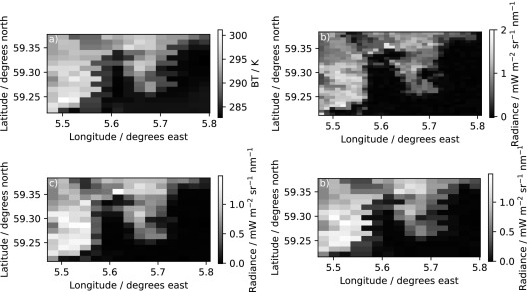

# SLSTR Preprocessor

Software for aggregating the SLSTR 500 m Vis/NIR channels (S1-6) onto
the 1 km IR grid ("i-stripe" as used for S7-9). Two programs are
included at present:
* `s3testpp` - test program allowing control over aggregation settings
* `s3regrid` - program to produce minimal volume "SLSTR-Lite" files

Code can be obtained from:
* github: https://github.com/surftemp/slstr-preprocessor
* zenodo: https://zenodo.org/record/6566799

## Introduction

The Sea and Land Surface Temperature Radiometer (SLSTR) instruments are
dual-view scanning radiometers with Vis/NIR reflectance channels at 500 m
and thermal infrared at 1 km resolution. These are measured on a conical
scan before being remapped to a regular image grid aligned with the
satellite track. It is commonly assumed that the 500 m Vis/NIR channels
can be matched to the IR channels with a simple 2x2 averaging. However,
this results in misalignments between the two due to the previous mapping
from measurement to image grid as shown in the example below.



Example of misalignment along Norwegian coastline from
[Bulgin et al. 2023](https://dx.doi.org/10.1016/j.rse.2023.113531)
* **Top-left**: SLSTR S7 channel shows saw-tooth edge along coastline when
  viewing data in image grid. These artefacts are due to assuming pixels
  are on a regular "square" grid - the actual location of each pixel may
  by up to 1/2 pixel (500 m) from the "grid centre".
* **Top-right**: SLSTR S6 channel at full higher 500 m resolution. The
  remapping from measurement to image grid was done at the native
  resolution so saw-tooth effect is not seen.
* **Lower-left**: SLSTR S6 coarsened to 1 km using simple 2x2 averaging.
  Pixels are closer to the nominal grid centres (no saw tooth), but do
  not correspond to the locations of IR observations.
* **Lower-tight**: SLSTR S6 remapped to IR pixel locations using this
  software. Saw-tooth artefacts are now visible along the coastline
  showing that data are mapped to the correct location for use with
  1 km channels.

The preprocessor can be used to correctly aggregate channels S1-6 to the
locations of channels S7-9 using nearest-neighbour algorithm. This works
as follows:

* First we compute a neighbourhood of Vis/NIR pixels that are closest to
  each target IR pixel
  * Neighbourhoods are defined using the K nearest neighbours that lie
    within a maximum radius
  * Cartesian distances are used, based on along-track and across-track
    offsets of each pixel
  * Cosmetically filled Vis/NIR pixels are ignored to avoid making a
    double contribution to the output
  * Orphan pixels are used in the neighbourhood
  * Choose from using the a-stripe or (where available) the b-stripe or
    a combination of a-stripe and b-stripe
    
* For each reflectance band, IR compatible rasters are then computed from all
  valid Vis/NIR pixels within the neighbourhood of each IR pixel, using the
  specified aggregation function(s).

  * A missing value is set if there are no suitable pixels in the neighbourhood
  * MEAN, MAX, SD (population standard deviation) and MAX-MIN aggregations
    are supported and other ones can easily be added
    
* For comparison purposes, a `simple` mode is provided which ignores the
  along and across track distances and aggregates the visible band value
  for an IR pixel at indexes (x,y) by agggregating the 4 visible pixels at
  indexes (2x,2y),(2x+1,2y),(2x,2y+1),(2x+1,2y+1)
  

**Note** - the product specification for Sentinel 3A/3B SLSTR data is available
from: https://sentinel.esa.int/documents/247904/1872792/Sentinel-3-SLSTR-Product-Data-Format-Specification-Level-1


## Installation

1. Download the source code or clone the repo.
2. Update compiler settings in [Makefile](Makefile). The default configuration
   is for gfortra. Make sure you specify the correct location for your local installation of [netcdf-fortran](https://github.com/Unidata/netcdf-fortran)
3. Build with:
```bash
make clean
make
```


## s3regrid

The `s3regrid` program can be used to create "SLSTR-lite" files where the 500 m
Vis/NIR "a-stripe" and "b-stripe" data are replaced with regridded 1 km as
"i-stripe" data. This program was originally developed for the [ESA CCI SST project](https://climate.esa.int/en/projects/sea-surface-temperature/).

A Python wrapper is supplied to unzip the input full-size SLSTR L1b, call the
Fortran exectuable, and create a zip of the output SLSTR-lite. In order to
minimise the size of the output files the wrapper will also:
* Remove all "a", "b", "c", and "f" -stripe files with one exception:
  * `S?_quality_a?.nc` files are retained as these contain the Vis/NIR
    calibration data.
* Remove the following files:
  * `met_tx.nc` - We assume user will be using ERA-5 fields available on CEDA
  * i-stripe F2 data - as f-stripe F1 data was already removed above
* Delete all variables from files: `cartesian_in.nc` and `cartesian_io.nc`
  * The empty files are retained as some readers parse the global metadata
    contained in these.
* Remove elevation and orphan pixel information from `geodetic_in.nc` and
  `geodetic_io.nc`


### Usage
`s3regrid.py [-h] [--cut-dirs CUT_DIRS] [--prefix PREFIX] file [file ...]`

Positional arguments:
* `file` : Input SLSTR L1b zip file(s)

Options:
 * `-h`, `--help` : show this help message and exit
 * `--cut-dirs CUT_DIRS` : Cut this number of directory components
 * `--prefix PREFIX` : Output directory prefix (defult current directory)

### Example

`s3regrid.py /neodc/sentinel3a/data/SLSTR/L1_RBT/2020/01/01/S3A_*.zip --cut-dirs=5`

Will process all files located in the 1st Jan 2020 directory from the CEDA
archive and save regridded output files into the local directory 2020/01/01
(as we are cutting the first 5 path components: neodc...L1_RBT)


## s3testpp

To run the test program, supply the input folder containing an SLSTR scene
and specify the output folder into which the output files S*_radiance_in.nc
and S*radiance_io.nc are written.

* first, unzip the scene if zipped.  In the example below, the file is unzipped into the folder containing the `s3testpp` executable.

```
unzip S3A_SL_1_RBT____20200101T235811_20200102T000111_20200103T033745_0179_053_187_3420_LN2_O_NT_003.zip
```

* run with neighbourhood calculation, output files to /tmp:

```
./s3testpp S3A_SL_1_RBT____20200101T235811_20200102T000111_20200103T033745_0179_053_187_3420_LN2_O_NT_003.SEN3 /tmp
```

* run without neighbourhood calculation (old behaviour):

```
./s3testpp S3A_SL_1_RBT____20200101T235811_20200102T000111_20200103T033745_0179_053_187_3420_LN2_O_NT_003.SEN3 /tmp 
         --simple
```

* run with neighbourhood calculation and print basic neighbourhood statistics:

```
./s3testpp S3A_SL_1_RBT____20200101T235811_20200102T000111_20200103T033745_0179_053_187_3420_LN2_O_NT_003.SEN3 /tmp 
         --stats
```

* run with neighbourhood calculation, using K=6 and setting the maximum distance
  of a neighbour to 4000m:

```
./s3testpp S3A_SL_1_RBT____20200101T235811_20200102T000111_20200103T033745_0179_053_187_3420_LN2_O_NT_003.SEN3 /tmp 
          --effective_k 6 --max_distance 4000
```

### Output files and variables

For each visible channel C (1-6), a pair of output files are generated with the data regridded on the IR nadir and oblique angle grids, for example for channel 1 these are named:

* `S1_radiance_in.nc` - for nadir view
* `S1_radiance_io.nc` - for oblique view

Inside each file, with the default configuration, variables will be created for each aggregation function supported.

For example, in `S1_radiance_in.nc` the following variables will be created:

* `S1_radiance_max` - value is the maximum pixel value within the neighbourhood
* `S1_radiance_mean` - value is the mean pixel value within the neighbourhood
* `S1_radiance_min_max_diff` - value is the difference between the max and min values within the neighbourhood
* `S1_radiance_sd` - value is the population standard deviation of values in the neighbourhood


## Using the preprocessor in your own code

A [fortran integration module](SLSTR_Preprocessor.f90) should be linked with a client program to integrate this functionality.

Usage of this module can be described by the following code snippet:

```f90
USE slstr_preprocessor

! The module variable MISSING_R must first be set to represent missing values in array data returned by the module
! For example:
MISSING_R = -1.0e+30

! The module variable MAX_NEIGHBOUR_DISTANCE (defaults to 10000) - sets the maximum distance in metres a VIS pixel 
! can lie from the IR pixel center to be included in the neighbourhood calculation
! For example:
MAX_NEIGHBOUR_DISTANCE = 5000 

! Declare variable to hold the neighbourhood, the array will be allocated inside the compute_scene_neighbourhood
TYPE(NEIGHBOURHOOD_MAP), ALLOCATABLE, DIMENSION(:,:) :: neighbourhood
! Build neighbourhood mapping for the a-stripe, nadir view, opening files as needed from scene folder
CALL compute_scene_neighbourhood('n','/path/to/scene',neighbourhood,'a')

! Process visual band 4 from the nadir view, using the constructed neighbourhood mapping, and applying the mean function
! Possible functions are represented by module constants FUNCTION_MEAN, FUNCTION_MAX, FUNCTION_MIN_MAX_DIFF, FUNCTION_SD
! vis_output_radiance is a 2D array pre-allocated to receive the output.  Use up to the 5 nearest neighbours.
! use width=1500,height=1200 for nadir view
! use width=900,height=1200 for oblique view
REAL, ALLOCATABLE, DIMENSION(:,:) :: vis_output_radiance
ALLOCATE(vis_output_radiance(1500,1200))
CALL process_scene_band('n','/path/to/scene',4,vis_output_radiance,neighbourhood,5,FUNCTION_MEAN)

! Process further bands from the same scene and nadir view, by calling process_scene_band further times

! To process the scene band without using neighbourhood map (using the simple method) do not build the neighbourhood 
! The simple method agggregates pixels at location (2x,2y),(2x+1,2y),(2x,2y+1),(2x+1,2y+1)
TYPE(NEIGHBOURHOOD_MAP) :: empty_neighbourhood
REAL, ALLOCATABLE, DIMENSION(:,:) :: vis_output_radiance
ALLOCATE(vis_output_radiance(1500,1200))
CALL process_scene_band('n','/path/to/scene',4,vis_output_radiance,empty_neighbourhood,0,FUNCTION_MEAN)
```

In the example above, a neighbourhood was constructed on the pixels in the a-stripe.  A neighbourhood can similarly be constructed on the b-stripe:

```f90
CALL compute_scene_neighbourhood('n','/path/to/scene',neighbourhood,'b')
```

It is also possible to create a combined neighbourhood that includes the closest pixels drawn from both the a- and b-stripes, 
using the `merge_neighborhoods` subroutine:

```f90
TYPE(NEIGHBOURHOOD_MAP), ALLOCATABLE, DIMENSION(:,:) :: neighbourhood_a
TYPE(NEIGHBOURHOOD_MAP), ALLOCATABLE, DIMENSION(:,:) :: neighbourhood_ab
CALL compute_scene_neighbourhood('n','/path/to/scene',neighbourhood_a,'a')
CALL compute_scene_neighbourhood('n','/path/to/scene',neighbourhood_ab,'b')
CALL merge_neighbourhoods(neighbourhood_a,neighbourhood_ab)  ! the combined a/b stripe neighborhood is then stored in neighbourhood_ab
```

Note that the behaviour of `process_scene_band` using a neighbourhood which includes b-stripe data will raise an error and cause the program to stop,
when called for a visible channel which does not include a b-stripe in the input data.

## Customising compile time options

Edit the module parameters of [fortran integration module](SLSTR_Preprocessor.f90) to customise its behaviour

The most commonly used parameter sets the maximum limit on the number of neighbours that can used (the `effective_k` parameter passed to `process_scene_band`)

* MAX_K_NEAREST_NEIGHBOURS (defaults to 10) - controls how many neighbours (K) at most can be aggegrated to compute an output pixel

```f90
!> Maximum neighbourhood size.
INTEGER, PARAMETER :: MAX_K_NEAREST_NEIGHBOURS = 10
```


